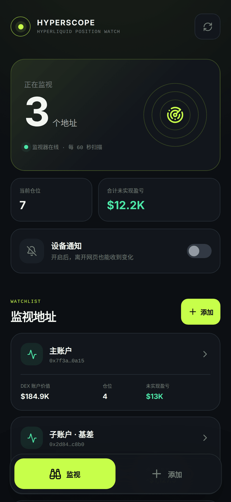
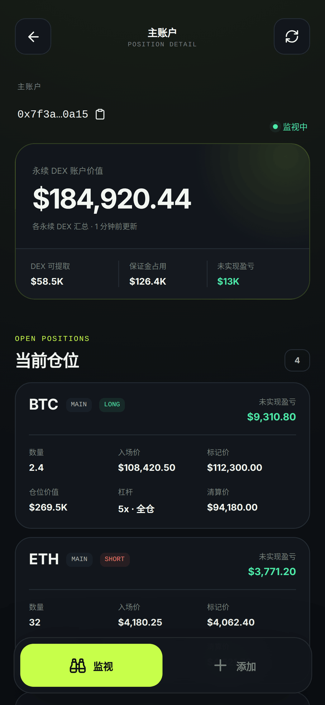
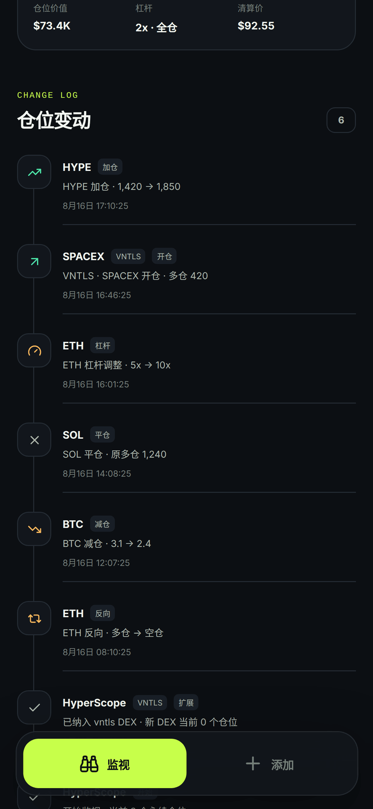
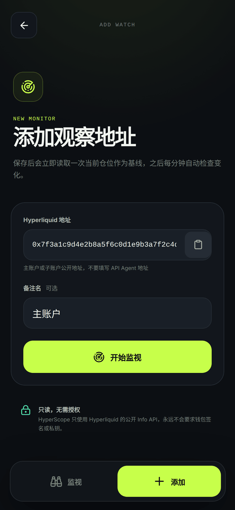

# HyperScope

[](https://github.com/umiiii/HyperScope/actions/workflows/ci-deploy.yml)
[](https://nextjs.org)
[](https://www.typescriptlang.org)
[](https://nodejs.org)
[](https://www.postgresql.org)
[](https://developer.mozilla.org/docs/Web/API/Push_API)
[](https://railway.app)
[](https://hyperliquid.gitbook.io/hyperliquid-docs)

HyperScope 是一个移动优先的 Hyperliquid 仓位监视 PWA。添加公开地址后，它会保存当前永续仓位作为基线，由 Railway 常驻 worker 每分钟重新读取；检测到开仓、平仓、加减仓、反向、入场均价或杠杆变化时，会通过 Web Push 通知已订阅设备。

应用不需要登录，也不会请求钱包连接、签名或私钥。当前版本按单一使用者的小规模 MVP 设计。

## 三个界面

| 仪表盘 | 当前仓位 | 仓位变动 | 添加地址 |
| :---: | :---: | :---: | :---: |
| [](docs/screenshots/dashboard.png) | [](docs/screenshots/positions.png) | [](docs/screenshots/changes.png) | [](docs/screenshots/add.png) |
| `/` | `/addresses/[id]` | `/addresses/[id]` | `/addresses/new` |

截图使用演示数据，不是真实账户；地址与仓位均为构造值。

- `/`：仪表盘，展示正在监视的地址数、worker 状态与各地址概览；设备开启通知后可向当前设备发送测试通知。
- `/addresses/new`：添加一个主账户或子账户公开地址。
- `/addresses/[id]`：查看当前仓位、账户摘要和仓位变化记录。

## 技术结构

- Next.js 16 App Router：页面、PWA Manifest 和 JSON API。
- PostgreSQL：持久化地址、仓位快照、变化记录、设备订阅和推送 outbox。
- Railway Web Service：运行 Next.js standalone 服务。
- Railway Worker Service：常驻进程，每 60 秒扫描到期地址并发送通知。
- Hyperliquid Info API：缓存 `perpDexs` 目录，并读取主永续 DEX 与全部 HIP-3 builder DEX 的 `clearinghouseState`。
- Service Worker + VAPID：即使 PWA 页面关闭，仍可显示系统通知。

第一次读取只建立基线，不发送通知。监视失败时会保留旧快照，避免把临时网络错误误报成全部平仓。盈亏、仓位价值、清算价等随行情变化的字段只用于展示，不会单独触发通知。

每个 DEX 都保存独立的快照时间。系统首次发现新的 builder DEX 时只为该 DEX 建立基线，不会把原有仓位误报为刚开仓；后续才正常检测变化。页面中的“DEX 账户价值”是各永续 DEX 返回值的汇总，不包含现货余额。

## 本地运行

要求 Node.js 22+ 和 PostgreSQL。

```bash
npm install
npm run vapid:generate
```

复制 `.env.example` 为 `.env.local`，填写数据库和 VAPID 三项。`VAPID_SUBJECT` 是推送服务管理员的联系 URI，例如 `mailto:ops@example.com`；公私钥必须来自同一次生成，并长期保留。

先启动网页：

```bash
npm run dev
```

另开一个终端构建并启动监视进程：

```bash
npm run build:worker
npm run worker
```

桌面浏览器可在 `localhost` 测试通知。iPhone 需要 iOS/iPadOS 16.4+，并应使用 HTTPS 部署地址：在 Safari 中“分享 → 添加到主屏幕”，从主屏图标打开后再开启通知。

## Railway 部署

在同一个 Railway Project 中创建：

1. 一个 PostgreSQL 服务。
2. 一个 Web Service，配置文件使用仓库根目录的 `/railway.json`，并生成公开 HTTPS 域名。
3. 一个 Worker Service，来源使用同一 GitHub 仓库，配置文件路径设为 `/railway.worker.json`；不要为它生成公开域名，副本数保持 1，并关闭 Serverless/App Sleeping。

Web 和 Worker 都连接同一数据库，并配置相同变量：

```text
DATABASE_URL=${{Postgres.DATABASE_URL}}
APP_URL=https://<你的 Railway 公网域名>
VAPID_SUBJECT=mailto:you@example.com
VAPID_PUBLIC_KEY=<生成的公钥>
VAPID_PRIVATE_KEY=<生成的私钥>
MONITOR_INTERVAL_MS=60000
MAX_MONITORED_ADDRESSES=40
```

`${{Postgres.DATABASE_URL}}` 是 Railway 私网引用，`Postgres` 必须与数据库服务名一致。`PUSH_ADMIN_TOKEN` 已不再使用：推送由仓位变化自动触发，而不是开放一个手工发送接口。

VAPID 公钥和私钥必须来自同一次生成并长期保持不变；更换密钥后，已订阅设备需要重新开启通知。

首次健康检查会自动创建数据库表。Web 使用 `/api/health`；Worker 在 Railway 注入的端口提供独立 `/health`，只有数据库初始化和常驻进程启动完成后才返回成功。Worker 使用 Free/Trial 也支持的 `ON_FAILURE` 重启策略，并有 30 秒优雅退出窗口。

## GitHub Actions 自动部署

工作流位于 `.github/workflows/ci-deploy.yml`。Pull Request 只执行 lint、类型检查、差异规则测试和两个生产构建；推送到 `main` 或手动运行工作流时，在全部校验通过后依次部署 Web 与 Worker。

在 GitHub 建立 `production` Environment，并配置：

| 类型 | 名称 | 内容 |
| --- | --- | --- |
| Secret | `RAILWAY_TOKEN` | Railway production Project Token |
| Variable | `RAILWAY_PROJECT_ID` | Project ID |
| Variable | `RAILWAY_ENVIRONMENT_ID` | production Environment ID |
| Variable | `RAILWAY_WEB_SERVICE_ID` | Web Service ID |
| Variable | `RAILWAY_WORKER_SERVICE_ID` | Worker Service ID |

如果使用这条 GitHub Actions 流水线，请关闭两个 Railway Service 自带的 GitHub Autodeploy，避免同一提交重复部署。只有提交真正进入 `main` 后才会自动部署；本地未提交或未推送的改动不会影响线上。

从只监视主 DEX 的旧版本首次升级到 HIP-3 版本时，应先停止旧 Worker，再部署 Web 和新 Worker。旧 Worker 会按地址整体替换仓位，不能与已写入 HIP-3 数据的新版本重叠运行；如需回滚，也应先停止 Worker，不能直接恢复旧 Worker。

## API

- `GET /api/health`：数据库与网页健康检查。
- `GET /api/addresses`、`POST /api/addresses`：仪表盘数据与添加地址。
- `GET /api/addresses/[id]`、`DELETE /api/addresses/[id]`：详情与停止监视。
- `POST /api/addresses/[id]/refresh`：手动读取一次仓位。
- `GET /api/push/config`：读取运行时 VAPID 公钥。
- `POST /api/push/subscriptions`、`DELETE /api/push/subscriptions`：保存或移除设备订阅。
- `POST /api/push/test`：只向请求中的当前已登记设备发送测试通知；完整订阅密钥必须匹配，且每台设备每分钟最多测试一次。

## MVP 边界

- 读取主永续 DEX 和 `perpDexs` 当前列出的 HIP-3 builder DEX；DEX 目录缓存 10 分钟，已监视过的 DEX 即使暂时未出现在目录中也会继续读取。
- 每分钟比较快照，因此一次轮询间隔内发生又完全恢复的短暂仓位变化可能无法捕获。
- 没有账户系统；所有访问者共享同一观察列表和推送事件，适合单人私用部署，不适合公开多租户服务。
- 地址数量默认限制为 40，以便在当前 10 个永续 DEX 下为 Hyperliquid 的 IP 级限流保留余量。请求按每秒最多 8 次启动、并发最多 8 次；任一 DEX 请求失败都不会覆盖上一份成功快照。

## 发布前校验

```bash
npm run lint
npm run typecheck
npm test
npm run build
npm run build:worker
```
